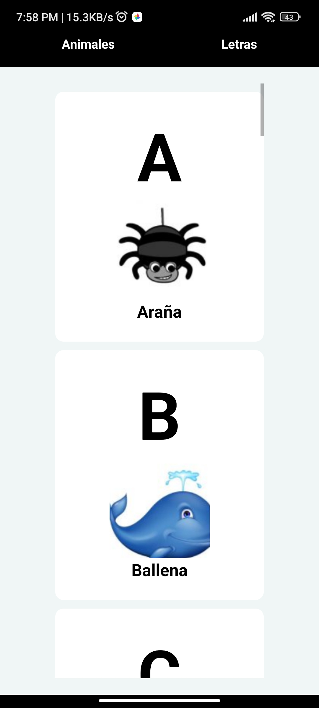
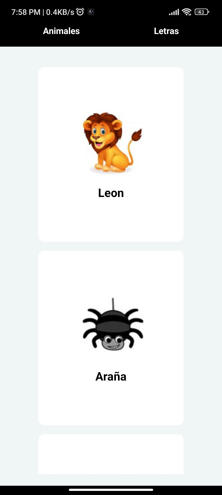

# 📖 Documentación del proyecto App Animals and alphabet 
 
# 🖼️ Visualización del proyecto

## 🦊 🔠 Animales y letra 


## 🦊🎵 Animales y Sonido

 
# 🖼️ Uso del proyecto 
Clona o descarga el proyecto 
```bash
git clone https://github.com/LizandroBackEnd/App_animals.git
```  
 
Instala las dependencias 
```bash
npm install
```   
 
Corre la aplicacion 
```bash
npm start
```   
Escanea el codigo QR con la app de EXPO GO en tu movil o emulador.
